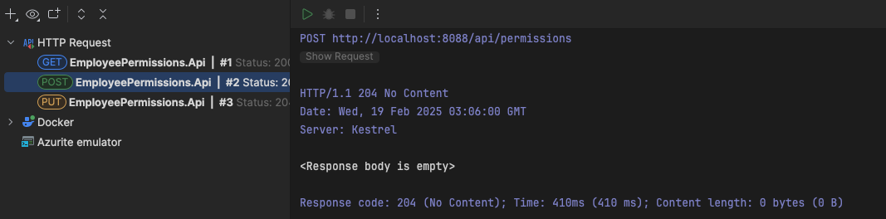
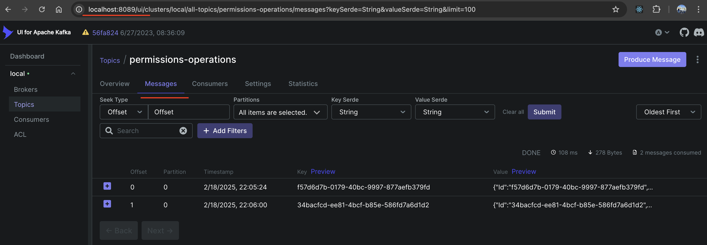
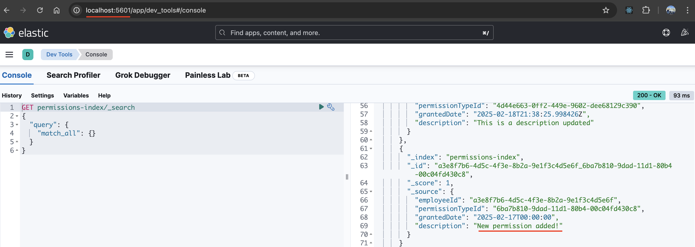

# Employee Permissions System

A modern .NET Core Web API system for managing employee permissions with enterprise-grade features including distributed
storage, messaging, and monitoring capabilities.

## System Architecture

### Technologies

- **.NET 9 Web API** with layered architecture
    - **xUnit**, **Moq** for unit & integration testing
- **SQL Server** for persistent storage
- **Elasticsearch** for efficient permission querying
- **Apache Kafka** for event streaming
- **Docker** for containerization
- **Serilog** for comprehensive logging

### Solution Structure

```
EmployeePermissions/
├── src/
│   ├── EmployeePermissions.Core/
│   │   ├── Entities/
│   │   │   ├── Employee.cs
│   │   │   ├── Permission.cs
│   │   │   └── PermissionType.cs
│   │   ├── Interfaces/
│   ├── EmployeePermissions.Application/
│   │   ├── Commands/
│   │   ├── Queries/
│   │   ├── Interfaces/
│   │   ├── Services/
│   │   └── DTOs/
│   ├── EmployeePermissions.Infrastructure/
│   │   ├── Persistence/
│   │   │   ├── Configurations/
│   │   │   ├── Migrations/
│   │   │   ├── ApplicationDbContext.cs
│   │   ├── Repositories/
│   │   ├── Kafka/
│   │   │   └── KafkaService.cs
│   │   ├── Elasticsearch/
│   │   │   └── ElasticsearchService.cs
│   └── EmployeePermissions.Api/
│       ├── Controllers/
│       │   ├── PermissionsController.cs
│       ├── Extensions/
│       ├── Program.cs
│       └── appsettings.json
├── tests/
│   ├── EmployeePermissions.UnitTests/
│   └── EmployeePermissions.IntegrationTests/
├── Dockerfile
├── docker-compose.yml
├── README.md
```

### Domain Model

- **Employees**: Core user entities
- **Permission Types**: Predefined categories (e.g., Vacation, Medical)
- **Permissions**: Records linking employees to permission types, including grant date and description
- Implements one-to-many relationship between employees and permissions

### Architectural Layers

1. **Core Layer**
    - Domain entities and business logic
    - Core interfaces and domain services

2. **Application Layer**
    - CQRS implementation
    - DTOs and mapping
    - Application services and business rules

3. **Infrastructure Layer**
    - Entity Framework Core repositories
    - Kafka message producer
    - Elasticsearch client implementation
    - Unit of Work pattern implementation

4. **Web API Layer**
    - RESTful endpoints
    - Controller implementations
    - Serilog integration

## API Endpoints

### Core Operations

1. **Request Permission**
    - Method: POST
    - Creates new permission records
    - Triggers Elasticsearch indexing and Kafka event

2. **Modify Permission**
    - Method: PUT
    - Updates existing permissions
    - Synchronizes changes across all systems

3. **Get Permissions**
    - Method: GET
    - Retrieves permission records
    - Supports filtering and pagination

### Data Flow

- Each operation is:
    - Persisted in SQL Server
    - Indexed in Elasticsearch
    - Published to Kafka with operation metadata
    - Logged via Serilog

## Deployment

### Docker Infrastructure

All components run in containers managed by Docker Compose:

- SQL Server 2022
- Elasticsearch and Kibana
- Apache Kafka and Zookeeper
- Kafka UI Management Interface

### Network Configuration

```bash
# Create dedicated network
docker network create employee-permissions-network
```

### Development Environment (Local)

```bash
# Launch development services
export DB_PASSWORD="The_strong_P4ssw0rd"
docker compose -f docker-compose.dev.yml up -d
```

Development Access Points:

- SQL Server: localhost:1433
- Kafka: localhost:29092
- Elasticsearch: http://localhost:9200
- Management UIs:
    - Kafka UI: http://localhost:8089
    - Kibana: http://localhost:5601

### Containerized Environment

```bash
# Launch Containerized stack
export CONNECTIONSTRINGS_DEFAULTCONNECTION="Server=sqlserver;Database=PermissionsDb;User Id=sa;Password=The_strong_P4ssw0rd;TrustServerCertificate=True"
export DB_PASSWORD="The_strong_P4ssw0rd"
export HTTP_PORT="8088"
docker compose up -d
```

Containerized Access Points:

- API: http://localhost:${HTTP_PORT}
- SQL Server: localhost:1433
- Kafka: localhost:9092
- Elasticsearch: http://localhost:9200
- Management UIs:
    - Kafka: http://localhost:8089
    - Kibana: http://localhost:5601

## API in Action

The API provides three main endpoints for managing employee permissions. You can test these endpoints using the provided
`EmployeePermissions.Api.http` file.

#### Base Configuration

```http
@host = http://localhost:8088
```

#### 1. Get Permissions

Retrieves all permissions in the system.

```http
GET {{host}}/api/permissions
Accept: application/json
```

#### 2. Request Permission

Creates a new permission record.

```http
POST {{host}}/api/permissions
Content-Type: application/json

{
  "employeeId": "a3e8f7b6-4d5c-4f3e-8b2a-9e1f3c4d5e6f",
  "permissionTypeId": "6ba7b810-9dad-11d1-80b4-00c04fd430c8",
  "grantedDate": "2025-02-17T00:00:00",
  "description": "New permission added!"
}
```

#### 3. Modify Permission

Updates an existing permission record.

```http
PUT {{host}}/api/permissions
Content-Type: application/json

{
  "employeeId": "a3e8f7b6-4d5c-4f3e-8b2a-9e1f3c4d5e6f",
  "permissionTypeId": "6ba7b810-9dad-11d1-80b4-00c04fd430c8",
  "grantedDate": "2025-03-17T00:00:00",
  "description": "Permission updated!"
}
```

#### System Integration Example

The following screenshots demonstrate the complete flow of a permission request through the system:

**Request Permission**: *Creating a new permission through the API endpoint*
<p></p>

<br>

**Kafka Message**: *Messages generated in Kafka topics after permission operations*
<p></p>

<br>

**Elasticsearch Data**: *Indexed permission data in Elasticsearch*
<p></p>

### Essential Database Commands

To create a new database migration, execute the following command from the root directory:

```bash
# Add a new migration
dotnet ef migrations add "NewMigration" --project src/EmployeePermissions.Infrastructure --startup-project src/EmployeePermissions.Api --context ApplicationDbContext --output-dir Persistence/Migrations

# Update the database
dotnet ef database update --project src/EmployeePermissions.Infrastructure --startup-project src/EmployeePermissions.Api --context ApplicationDbContext
```

Happy coding! 🚀